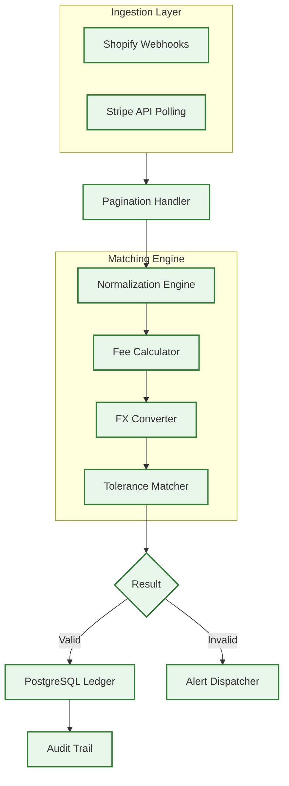

# 🏗️ Technical Architecture — paybridge

## Components
- **Ingestion Engine**: A rate-limit-aware service that handles paginated API requests from Shopify and Stripe.
- **Normalization Engine**: Standardizes transaction data, calculating net amounts by accounting for gateway fees and currency exchange rates.
- **Tolerance Matcher**: A logic gate that permits minor rounding differences while flagging significant discrepancies for manual review.

## Data Flow
1. **Extraction**: Transaction data is fetched via webhooks and scheduled API polls.
2. **Transformation**: Raw data is flattened and normalized into a unified schema.
3. **Calculation**: The system applies fee models and FX rates to determine the expected payout.
4. **Reconciliation**: Transactions are matched by ID; mismatches trigger immediate alerts.
5. **Persistence**: Every matched pair is written to an immutable ledger for month-end reporting.

## Resilience & Compliance
- **Idempotency Guarantees**: Every node is designed to be re-run safely without creating duplicate records.
- **Isolation**: The system is self-hosted in an isolated Docker environment to ensure data sovereignty.
- **Audit Trails**: All matches and discrepancies are logged with high-fidelity timestamps.

## Confidentiality
Matching logic specifics, fee structures, and full workflow exports are withheld to protect proprietary financial operations.
