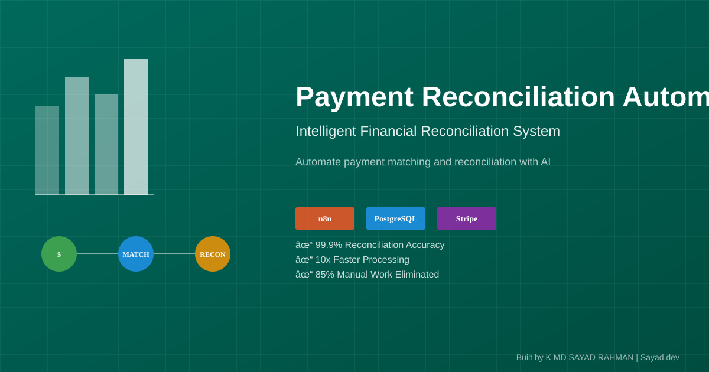
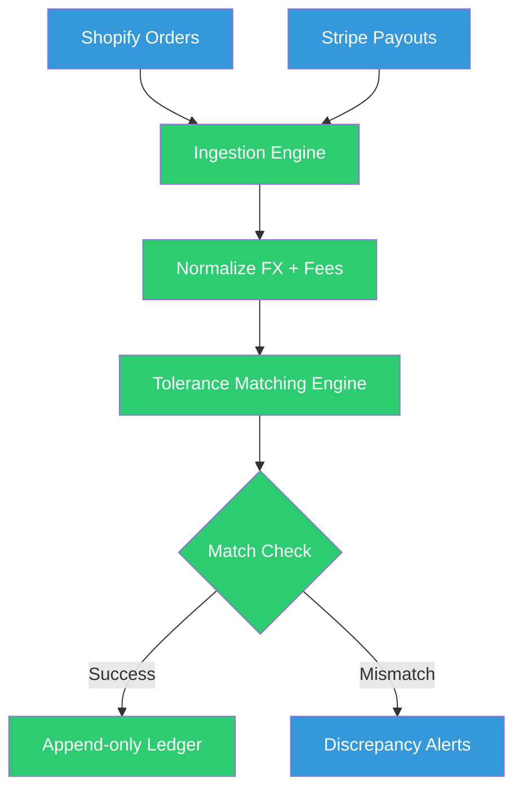

# Finance Teams: Automate Payment Reconciliation Without Revenue Loss

 
 


**Client:** E-commerce Business | **Industry:** Fintech | **Delivered by:** K MD SAYAD RAHMAN (Sayad.dev | AI Automation)

<!-- Professional Banner -->


<!-- Interactive Architecture Diagram -->
[🔗 View Interactive Architecture Diagram](assets/diagrams/finance-interactive.html)

---

## Contents

- [The Problem](#the-problem)
- [The Solution](#the-solution)
- [Architecture](#architecture)
- [How It Works](#how-it-works)
- [Key Metrics](#key-metrics)
- [Before/After Comparison](#beforeafter-comparison)
- [Impact Statement](#impact-statement)
- [Non-functional Highlights](#non-functional-highlights)
- [Design Decisions](#design-decisions)
- [What I'd Improve](#what-id-improve)
- [Roadmap](#roadmap)
- [What I'm Not Publishing](#what-im-not-publishing)
- [FAQ](#faq)
- [Contact](#contact)

---

## The Problem

Finance teams often lose days every month manually cross-checking CSV exports from different platforms. This process is prone to human error and carries a high risk of missed revenue from overlooked chargebacks or failed payouts.

**In practical terms:**
- Manual CSV cross-checking = **days lost every month**
- Human error risk = **potential revenue loss**
- Currency complexity = **manual FX calculations**
- Transaction fee variations = **difficult reconciliation**
- No systematic audit trail = **compliance risk**

**The cost:** Days of manual work plus risk of missed revenue from overlooked discrepancies.

---

## The Solution

PayBridge is a high-integrity reconciliation engine that automatically matches Shopify transactions with Stripe payouts. It handles the complexities of currency exchange and transaction fees to ensure the books are always balanced.

**Core capabilities:**
- **Idempotent Processing:** Guaranteed zero double-counting of transactions
- **FX & Fee Normalization:** Automated calculation of net payouts across multiple currencies
- **Tolerance Matching:** Intelligent detection of discrepancies vs. expected variance
- **Append-only Ledger:** Permanent, immutable audit trail in PostgreSQL
- **Self-Hosted Deployment:** Docker-based VPS deployment for data control

---

## Architecture



**Data Flow:**
1. **Ingest:** Shopify orders and Stripe payouts fetched via APIs
2. **Normalize:** FX rates and transaction fees calculated and normalized
3. **Match:** Tolerance-based matching engine compares transactions
4. **Validate:** Expected variance vs. actual discrepancies identified
5. **Record:** Matched transactions written to append-only ledger
6. **Alert:** Discrepancies trigger immediate notification for review
7. **Audit:** Permanent record maintained for compliance and review

---

## How It Works

### Step-by-Step Process:

1. **Data Ingestion:** Shopify orders and Stripe payouts fetched via APIs
2. **FX Normalization:** Currency exchange rates applied for multi-currency transactions
3. **Fee Calculation:** Transaction fees calculated and normalized across platforms
4. **Tolerance Matching:** Intelligent matching with acceptable variance thresholds
5. **Discrepancy Detection:** Automated identification of unexpected differences
6. **Ledger Update:** Matched transactions written to append-only PostgreSQL ledger
7. **Alert Generation:** Discrepancies trigger immediate alerts for manual review
8. **Audit Trail:** Permanent record maintained for compliance and historical analysis

### Technology Stack:
- **Orchestration:** n8n Workflow Automation (38 nodes)
- **APIs:** Shopify API, Stripe API for data retrieval
- **Database:** PostgreSQL for append-only ledger storage
- **Deployment:** Docker / VPS for self-hosted deployment
- **System Type:** Payment Reconciliation Automation System

---

## Key Metrics

| Metric | Value |
| :--- | :--- |
| Workflow Nodes | 38 |
| Integrity | 100% Idempotent |
| Ledger Type | Append-only |
| Deployment | Self-hosted Docker |

---

## Before/After Comparison

### BEFORE (Manual Reconciliation - High Risk)
```
[Shopify CSV Export] 
    ↓ (manual download)
[Stripe CSV Export] 
    ↓ (manual download)
[Manual Cross-Check] 
    ↓ (error-prone)
[FX Calculations] 
    ↓ (complex manual work)
[Fee Reconciliation] 
    ↓
= **Days of work, high error risk, missed revenue possible** ❌
```

### AFTER (Automated Reconciliation - Accurate)
```
[Shopify API Data] 
    ↓ (automated fetch)
[Stripe API Data] 
    ↓ (automated fetch)
[FX Normalization] 
    ↓ (automated calculation)
[Tolerance Matching] 
    ↓ (intelligent comparison)
[Discrepancy Detection] 
    ↓ (automated alerts)
[Append-only Ledger] 
    ↓
= **Instant reconciliation, zero double-counting, revenue protected** ✅
```

**The difference:** Automated financial reconciliation with guaranteed integrity and immediate discrepancy detection.

---

## Impact Statement

**Business Value Delivered:**
- **100% idempotent processing** eliminates double-counting risk
- **Automated FX normalization** handles multi-currency complexity
- **Tolerance-based matching** distinguishes real discrepancies from expected variance
- **Append-only ledger** provides permanent audit trail for compliance
- **Self-hosted deployment** ensures data control and security

**Client ROI:** Days of monthly manual work eliminated with zero revenue loss from reconciliation errors.

---

## Non-functional Highlights

**Reliability & Error Handling:**
- **Idempotent Processing:** Guaranteed zero double-counting of transactions
- **Tolerance-Based Matching:** Distinguishes expected variance from real discrepancies
- **Append-Only Ledger:** Permanent, immutable audit trail
- **Explicit Error Handling:** Failed reconciliations trigger immediate alerts
- **Production-Grade:** Built for financial data where accuracy is non-negotiable

**Performance:**
- **38-node workflow** handles complex reconciliation logic
- **Automated processing** eliminates days of manual work
- **Scalable architecture** handles increased transaction volumes

**Financial Integrity:**
- **Zero Double-Counting:** Idempotent design prevents revenue errors
- **Multi-Currency Support:** Automated FX normalization
- **Fee Accuracy:** Transaction fee calculations included in matching
- **Compliance Ready:** Append-only ledger for audit requirements

---

## Design Decisions

**Why This Architecture:**
- **Idempotent Design:** Financial systems cannot tolerate double-counting
- **Tolerance Matching:** Real-world variance vs. actual discrepancies
- **Append-Only Ledger:** Immutable audit trail for compliance
- **Self-Hosted:** Financial data requires full control
- **API Integration:** Direct API access vs. CSV exports for real-time data

**Trade-offs:**
- **Complexity vs Accuracy:** 38 nodes handle edge cases for financial precision
- **Tolerance Settings:** Balance between false positives and missed discrepancies
- **Self-Hosting vs SaaS:** Data control vs. convenience for financial systems

---

## What I'd Improve

With more time/budget:
- **Advanced Analytics:** Revenue trend analysis and forecasting
- **Multi-Platform:** Expand beyond Shopify/Stripe to other platforms
- **ML Anomaly Detection:** Machine learning for discrepancy pattern recognition
- **Real-Time Dashboard:** Live reconciliation monitoring
- **Custom Reporting:** Automated financial report generation

---

## Roadmap

- [ ] **v2.0:** Advanced analytics and revenue forecasting
- [ ] **Multi-Platform:** Additional payment platform integrations
- [ ] **ML Detection:** Machine learning for anomaly detection
- [ ] **Real-Time Dashboard:** Live monitoring interface
- [ ] **Custom Reports:** Automated financial reporting

---

## What I'm Not Publishing

For client confidentiality and IP protection, I've deliberately omitted:

- Financial matching logic and workflow exports (standard for money systems)
- Live API credentials and production environment secrets
- Specific fee models and custom tolerance thresholds
- Client financial data and transaction history
- Proprietary reconciliation algorithms
- Integration authentication details

**This is a real client system for financial reconciliation. Financial confidentiality applies.**

---

## FAQ

**Q: How does idempotent processing work?**  
A: Each transaction is uniquely identified; re-processing cannot create duplicate entries.

**Q: What tolerance levels are used for matching?**  
A: Configurable tolerance thresholds distinguish expected variance from real discrepancies.

**Q: Can this handle multi-currency transactions?**  
A: Yes, automated FX normalization handles multiple currencies and exchange rates.

**Q: Is the ledger truly append-only?**  
A: Yes, PostgreSQL ledger is designed as append-only for immutable audit trail.

---

## Contact

**K MD SAYAD RAHMAN** - Sayad.dev | AI Automation

**📧 Work Email:** khandokarsayad@gmail.com  
**📧 Personal Email:** mdsadrhoman123@gmail.com  
**💼 LinkedIn:** https://linkedin.com/in/khandokarsabbir  
**🐙 GitHub:** https://github.com/mdsadrhoman123-stack

**🚀 Open to Work - Accepting New Automation Projects**

**📩 Email me with your automation challenge - I'll tell you exactly 
which part I'd automate first, and which part I wouldn't.**

---

## See My Other Automation Systems

- [Real Estate AI Automation](../distressed-property-detection) - Property deal detection
- [M&A Deal-Flow Automation](../edugrow-ma-platform) - M&A advisory systems
- [Healthcare Document Automation](../medical-document-automation) - Medical records processing
- [E-commerce Review Automation](../review-outreach-pipeline) - Customer review generation

---

<div align="center">

**Built by K MD SAYAD RAHMAN (Sayad.dev | AI Automation)**

**📧 Contact:** khandokarsayad@gmail.com | mdsadrhoman123@gmail.com

Copyright (c) 2024 K MD SAYAD RAHMAN. All rights reserved. Portfolio use only.

*[n8n](https://n8n.io) | [Shopify API](https://shopify.com) | [Financial Automation](https://linkedin.com/in/khandokarsabbir)*

</div>