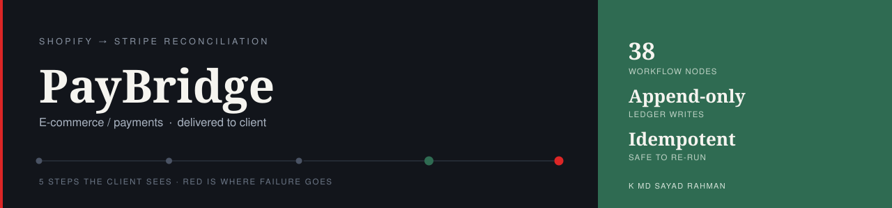

# PayBridge

**Orders and payouts are matched continuously with fees and currency handled, and only genuine discrepancies interrupt a human.**

   

| | |
| :--- | :--- |
| **Built for** | E-commerce business on Shopify + Stripe |
| **Industry** | E-commerce finance |
| **Status** | delivered to client |
| **Role** | Designed, built and deployed end to end |

---

### On this page

[The problem](#the-problem) · [What changed](#what-changed) · [How it works](#how-it-works) · [When it breaks](#when-it-breaks) · [The stack](#the-stack) · [Limitations](#honest-limitations) · [Read deeper](#read-deeper)

---

## The problem

An e-commerce finance team was closing their books by hand every month — days of cross-referencing exported spreadsheets and manual lookups.

The cost was not only the days. Partial refunds, currency conversion adjustments and the occasional failed payout are easy to miss in a manual process, so real revenue could go unaccounted for with nobody noticing until much later, if at all.

Financial reconciliation has no tolerance for “close enough”. A job that is mostly accurate on money is worse than no automation, because it creates false confidence.

## What changed

| | Before | After |
| :--- | :--- | :--- |
| **Month-end close** | Days of manual spreadsheet work | Runs continuously in the background |
| **Discrepancy found** | Weeks later, if at all | Within hours of occurring |
| **Alert volume** | Everything looked like a mismatch | Only genuine mismatches surface |
| **Audit trail** | None | Append-only financial ledger |
| **Where the data lives** | Third-party cloud tools | Self-hosted, client-controlled |

Before/after describes the change in process, not benchmarked throughput. Where a number is not measured, it is not claimed.

## How it works

Scheduled, rate-limit-aware pulls from both APIs feed a matching engine with tolerance rules for expected variance. Everything lands in an append-only ledger that is safe to re-run, and only genuine mismatches raise an alert.

<table>
<tr>
<td width="42" valign="top" align="center"><b>01</b></td><td valign="top"><b>Nothing to do</b> The job runs on a schedule. No one exports a CSV.</td>
</tr>
<tr>
<td width="42" valign="top" align="center"><b>02</b></td><td valign="top"><b>Every order is matched</b> Order and payout are paired by ID and amount, with fees and currency applied.</td>
</tr>
<tr>
<td width="42" valign="top" align="center"><b>03</b></td><td valign="top"><b>Expected variance is ignored</b> Fees and FX differences do not become alerts. That is the difference between a useful system and a noisy one.</td>
</tr>
<tr>
<td width="42" valign="top" align="center"><b>04</b></td><td valign="top"><b>Real problems surface</b> A chargeback, a partial refund or a missing payout is held and flagged with both records attached.</td>
</tr>
<tr>
<td width="42" valign="top" align="center"><b>05</b></td><td valign="top"><b>The ledger is permanent</b> Every state change is appended. Nothing is overwritten, so last month can always be re-read.</td>
</tr>
<tr>
<td width="42" valign="top" align="center"><b>06</b></td><td valign="top"><b>Re-running is safe</b> If the job is run again it will not double-count. This requirement shaped the whole build.</td>
</tr>
</table>

### How it flows

What happens to the client's work, in the order they experience it. The internal build — node graph, execution order, prompts, thresholds — is deliberately not published.

<b>What the shapes mean</b> — colour is not the only signal

| Shape | Means |
| :--- | :--- |
| **rounded** | Where the client's process starts |
| **box** | Something the system does |
| **diamond** | A decision point |
| **slanted** | A person has to act |
| **green box** | The good outcome |
| **red box** | Failure path — held, escalated or alerted |

Red appears in exactly one role across every repo in this portfolio: where failure goes. Nowhere else. If you see red, something is being held, escalated or alerted.

> **Walk it interactively** — [open the demo](https://mdsadrhoman123-stack.github.io/paybridge/) and press **Break it** to watch the failure path light up. Source: [`docs/index.html`](docs/index.html)

## When it breaks

Most automation portfolios show you the happy path. The happy path is the easy half. This is the half that decides whether a system survives contact with a real business.

| What goes wrong | How it is detected | What the system does | Who finds out |
| :--- | :--- | :--- | :--- |
| **Job re-run after a partial failure** | Idempotency key per transaction | Existing ledger entries are not written twice | Nothing to report — by design |
| **Shopify or Stripe rate-limits the pull** | API response code | Backoff and retry rather than a silent skip | Alert only if retries are exhausted |
| **Amounts differ by fees or FX** | Tolerance rules | Treated as expected variance, not flagged | Nobody — this is what avoids alert fatigue |
| **Chargeback or partial refund** | Match logic | Held and flagged as a genuine discrepancy | Finance team alerted with both records |
| **Payout missing entirely** | Unmatched order after the window | Held for review, never auto-reconciled | Finance team alerted |
| **Anything unanticipated** | Global error trigger | Halt before writing to the ledger | Alert with execution ID |

The default on an unhandled condition is to **stop and tell someone** — never to continue on a guess. A silent success is the failure mode that costs the most, because nobody goes looking for it.

## The stack

| Component | Why this one |
| :--- | :--- |
| **n8n** | Self-hosted — no financial data through a third-party automation cloud |
| **Shopify API** | Order side of the match |
| **Stripe API** | Payout side of the match |
| **PostgreSQL** | Append-only ledger: states are recorded, never overwritten |
| **Docker on a self-hosted VPS** | Reproducible deployment under the client's own control |

### Counted, not estimated

| | |
| :--- | :--- |
| Workflow nodes | **38** |
| Ledger writes | **Append-only** |
| Safe to re-run | **Idempotent** |

These are counts from the built system — nodes, stages, versions, gates. No efficiency percentages are published here without a stated measurement method.

## Honest limitations

Every design decision costs something. These are the trade-offs in this build, stated by the person who made them.

- Built for one Shopify store against one Stripe account. Multiple stores would need a tenant key on every ledger row.
- Tolerance rules for fees and FX are configured, not learned. A new payment method or a fee change needs the rule updated.
- Matching is by ID and amount within a window. Deliberately conservative — an unmatched record is held rather than guessed at.

## What is not in this repo

- **Client data.** None, in any form. Not anonymised, not sampled.
- **Credentials and endpoints.** Never committed. See [`NOTICE.md`](NOTICE.md).
- **The workflow itself.** No exports, no node graph, no execution order, no prompts, no scoring thresholds, no integration wiring — not sanitised, not partial, not in a screenshot. That is the build, and the build belongs to the engagement that paid for it.

This repository documents *how the problem was thought about* — the failure paths, the trade-offs, the reasoning. That is what tells you whether to hire someone. A copy of the wiring would not.

This is a portfolio repository documenting delivered work. It is not a product you can clone and run against your own accounts.

## Read deeper

| | |
| :--- | :--- |
| [01 · The problem](docs/01-problem.md) | The situation before, in full |
| [02 · The client journey](docs/02-journey.md) | Step by step, from their side |
| [03 · Architecture](docs/03-architecture.md) | Diagrams and the reasoning |
| [04 · Failure handling](docs/04-failure-handling.md) | Every path, and where it lands |
| [05 · The stack](docs/05-stack.md) | What was chosen and what was rejected |
| [06 · Results](docs/06-results.md) | What is measured and what is not |
| [07 · Limitations](docs/07-limitations.md) | The trade-offs, in detail |

---

### Tell me what the process is

I will tell you honestly whether automating it is worth your money — including when the answer is no.

**K MD SAYAD RAHMAN** — AI Automation Engineer  
n8n · AI agents · production reliability  
[LinkedIn](https://www.linkedin.com/in/khandokarsayad) · [More systems](https://github.com/mdsadrhoman123-stack)

