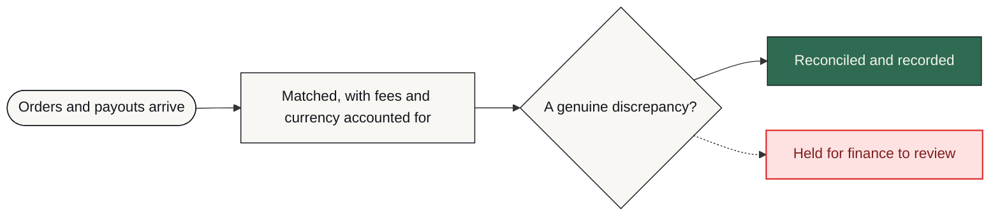

# PayBridge

**Orders and payouts are matched continuously with fees and currency handled, and only genuine discrepancies interrupt a human.**

     [](https://github.com/mdsadrhoman123-stack/paybridge/actions/workflows/honesty-check.yml)

> [!NOTE]
> **What this is.** A production-grade system built to a brief that businesses in this sector post publicly, in their own words — the problem exactly as they stated it, not one invented to demonstrate something. It was engineered the way anything a business actually depends on has to be: the failure paths designed before the features, every one of them logged and alerted rather than left to chance. It runs on my own infrastructure. It is ready to deploy for any business with this problem, and it has not been sold or deployed into a customer's business yet.

| | |
| :--- | :--- |
| **Built for** | E-commerce businesses on Shopify + Stripe |
| **The brief** | The problem exactly as businesses in this sector post it — public job briefs on Upwork and Fiverr, in their words, not my framing |
| **Industry** | E-commerce finance |
| **Status** | running on my own n8n |
| **Failure paths designed** | 6 — each with how it is detected, what the system does about it, and who finds out |
| **My role** | Sole engineer — scoping, architecture, build, failure design and operation |
| **Availability** | Ready to deploy for any business with this problem — built once as a product, not as a one-off. Running on my own infrastructure; not sold yet. |

---

### On this page

[The problem](#the-problem) · [What changed](#what-changed) · [How it works](#how-it-works) · [The shape of it](#the-shape-of-the-system) · [When it breaks](#when-it-breaks) · [Why this way](#why-it-is-built-this-way) · [Limitations](#honest-limitations) · [What is here](#what-is-in-this-repository) · [Read deeper](#read-deeper)

---

## The problem

An e-commerce finance team was closing their books by hand every month — days of cross-referencing exported spreadsheets and manual lookups.

The cost was not only the days. Partial refunds, currency conversion adjustments and the occasional failed payout are easy to miss in a manual process, so real revenue could go unaccounted for with nobody noticing until much later, if at all.

Financial reconciliation has no tolerance for “close enough”. A job that is mostly accurate on money is worse than no automation, because it creates false confidence.

## What changed

| | Before | After |
| :--- | :--- | :--- |
| **Month-end close** | Days of manual spreadsheet work | Runs continuously in the background |
| **Discrepancy found** | Weeks later, if at all | Within hours of occurring |
| **Alert volume** | Everything looked like a mismatch | Only genuine mismatches surface |
| **Audit trail** | None | Append-only financial ledger |
| **Where the data lives** | Third-party cloud tools | Self-hosted, client-controlled |

<sub>Before/after describes the change in process, not benchmarked throughput. Where a number is not measured, it is not claimed.</sub>

## How it works

Scheduled, rate-limit-aware pulls from both APIs feed a matching engine with tolerance rules for expected variance. Everything lands in an append-only ledger that is safe to re-run, and only genuine mismatches raise an alert.

<table>
<tr>
<td width="42" valign="top" align="center"><b>01</b></td><td valign="top"><b>Nothing to do</b><br>The job runs on a schedule. No one exports a CSV.</td>
</tr>
<tr>
<td width="42" valign="top" align="center"><b>02</b></td><td valign="top"><b>Every order is matched</b><br>Order and payout are paired by ID and amount, with fees and currency applied.</td>
</tr>
<tr>
<td width="42" valign="top" align="center"><b>03</b></td><td valign="top"><b>Expected variance is ignored</b><br>Fees and FX differences do not become alerts. That is the difference between a useful system and a noisy one.</td>
</tr>
<tr>
<td width="42" valign="top" align="center"><b>04</b></td><td valign="top"><b>Real problems surface</b><br>A chargeback, a partial refund or a missing payout is held and flagged with both records attached.</td>
</tr>
<tr>
<td width="42" valign="top" align="center"><b>05</b></td><td valign="top"><b>The ledger is permanent</b><br>Every state change is appended. Nothing is overwritten, so last month can always be re-read.</td>
</tr>
<tr>
<td width="42" valign="top" align="center"><b>06</b></td><td valign="top"><b>Re-running is safe</b><br>If the job is run again it will not double-count. This requirement shaped the whole build.</td>
</tr>
</table>

### How it flows

<sub>What happens to the client's work, in the order they experience it. The internal build — node graph, execution order, prompts, thresholds — is deliberately not published.</sub>



<details>
<summary><b>What the shapes mean</b> — colour is not the only signal</summary>

| Shape | Means |
| :--- | :--- |
| **rounded** | Where the client's process starts |
| **box** | Something the system does |
| **diamond** | A decision point |
| **slanted** | A person has to act |
| **green box** | The good outcome |
| **red box** | Failure path — held, escalated or alerted |

Red appears in exactly one role across every repo in this portfolio: where failure goes. Nowhere else. If you see red, something is being held, escalated or alerted.
</details>

> **Walk it interactively** — [`docs/index.html`](docs/index.html) is a single self-contained page. Download it, open it in any browser, and press **Break it** to watch the failure path light up. Nothing to install, no network calls.

## The shape of the system

Parts and the role each one plays. Not the wiring — no execution order, no prompt text, no thresholds. That is a deliberate line, and the last branch of the tree names exactly what sits on the other side of it.

```text
PayBridge — the running system
│
├── Interfaces ...................... the systems it talks to
│   ├── Shopify API ................. Order side of the match
│   └── Stripe API .................. Payout side of the match
│
├── Memory .......................... what is remembered, and for how long
│   └── PostgreSQL .................. Append-only ledger: states are recorded, never overwritten
│
├── Ground .......................... what the whole thing runs on
│   ├── n8n ......................... Self-hosted — no financial data through a third-party automation cloud
│   └── Docker on a self-hosted VPS . Reproducible deployment under the client's own control
│
├── Failure design .................. 6 paths, designed before the features
│   ├── detected by ................. an error output, a timer, or a failed connection
│   ├── handled by .................. falling back, holding, or halting — never guessing
│   └── announced to ................ a named person, with the reason attached
│
└── Not in this repository .......... the part that would let you skip the thinking
    ├── the node graph .............. which part runs after which, and on what condition
    ├── the thresholds .............. what counts as urgent, late, at capacity, a match
    └── the credentials ............. never committed, in any form, at any point
```

Read it as a set of decisions rather than a parts list. Every part is there because a specific failure or a specific constraint put it there, and the two sections below are the same story told twice: **When it breaks** is what each part is defending against, and **Honest limitations** is what it costs to have chosen that part and not another.

### Counted, not estimated

| | |
| :--- | :--- |
| Workflow nodes | **38** |
| Ledger writes | **Append-only** |
| Safe to re-run | **Idempotent** |

<sub>These are counts from the built system — nodes, stages, versions, gates. No efficiency percentages are published here without a stated measurement method.</sub>

## When it breaks

Most automation portfolios show you the happy path. The happy path is the easy half. This is the half that decides whether a system survives contact with a real business.

| What goes wrong | How it is detected | What the system does | Who finds out |
| :--- | :--- | :--- | :--- |
| **Job re-run after a partial failure** | Idempotency key per transaction | Existing ledger entries are not written twice | Nothing to report — by design |
| **Shopify or Stripe rate-limits the pull** | API response code | Backoff and retry rather than a silent skip | Alert only if retries are exhausted |
| **Amounts differ by fees or FX** | Tolerance rules | Treated as expected variance, not flagged | Nobody — this is what avoids alert fatigue |
| **Chargeback or partial refund** | Match logic | Held and flagged as a genuine discrepancy | Finance team alerted with both records |
| **Payout missing entirely** | Unmatched order after the window | Held for review, never auto-reconciled | Finance team alerted |
| **Anything unanticipated** | Global error trigger | Halt before writing to the ledger | Alert with execution ID |

The default on an unhandled condition is to **stop and tell someone** — never to continue on a guess. A silent success is the failure mode that costs the most, because nobody goes looking for it.

## Why it is built this way

Three decisions, each with the option that was turned down and the price of turning it down. A choice with no cost attached to it was not a choice — it was a default, and defaults are not worth reading about.

<details open>
<summary><b>Why the ledger is append-only</b></summary>

**What it does.** States are recorded, never overwritten, so the run is safe to repeat and yesterday's belief about a record survives today's correction.

**What was turned down.** Updating the row in place. A smaller store and a simpler query — and an overwrite destroys the evidence of what was believed before it, which in a financial process is the thing an auditor asks for.

**What that costs.** The store grows, and every read has to ask for the latest state rather than selecting one current row.

</details>

<details>
<summary><b>Why an unmatched record is held rather than guessed at</b></summary>

**What it does.** Matching is by ID and amount inside a window. Anything outside it is held for a person.

**What was turned down.** Fuzzy matching, to push the automatic rate higher. It would clear more records per run, and a wrong match on money produces false confidence — which is worse than no automation, because nobody goes looking for it.

**What that costs.** A real queue of held records that somebody has to work through. Tolerance rules for fees and FX are configured rather than learned, so a new payment method or a fee change needs the rule updated by hand.

</details>

<details>
<summary><b>Why it is self-hosted rather than on an automation cloud</b></summary>

**What it does.** n8n in Docker on a VPS the client controls. No financial data crosses a third-party automation platform.

**What was turned down.** A hosted SaaS. Far less to operate — and order and payout data then transits a vendor, and the failure handling can only ever be as good as what that vendor chooses to expose.

**What that costs.** The client owns uptime, backups and upgrades. Built for one Shopify store against one Stripe account; multiple stores would need a tenant key on every ledger row.

</details>

Every cost above also appears in **Honest limitations** below. It is there twice on purpose: once as the reasoning, once as the consequence, so neither can be quietly dropped from the other.

## Honest limitations

Every design decision costs something. These are the trade-offs in this build, stated by the person who made them.

- Built for one Shopify store against one Stripe account. Multiple stores would need a tenant key on every ledger row.
- Tolerance rules for fees and FX are configured, not learned. A new payment method or a fee change needs the rule updated.
- Matching is by ID and amount within a window. Deliberately conservative — an unmatched record is held rather than guessed at.

## What is in this repository

Every file, and the question it answers. Same layout in all eleven repositories in this portfolio, so the second one you open needs no orientation at all.

```text
paybridge/
├── README.md ....................... ← you are here
├── SECURITY.md ..................... how to report something that should not be public
├── NOTICE.md ....................... what is withheld, and why
├── LICENSE ......................... covers the documentation, not a software grant
│
├── docs/ ........................... the long form — read in order or not at all
│   ├── index.html .................. the interactive demo, one file, no network
│   ├── 01-problem.md ............... the situation before, in full
│   ├── 02-journey.md ............... step by step, from their side
│   ├── 03-architecture.md .......... the diagrams, and why they are shaped that way
│   ├── 04-failure-handling.md ...... every failure path, and where it lands
│   ├── 05-stack.md ................. each choice, the option turned down, the cost
│   ├── 06-results.md ............... what is measured, and what is deliberately not
│   └── 07-limitations.md ........... the trade-offs, in detail
│
├── diagrams/ ....................... source, so the flow can be re-rendered
│   ├── pipeline-lr.mmd ............. the client-level flow, left to right
│   └── pipeline-tb.mmd ............. the same flow, top to bottom
│
├── assets/ ......................... SVG only — nothing loaded from a CDN
│   ├── banner.svg .................. the header on this page
│   └── cta.svg ..................... the closing card
│
├── workflows/ ...................... empty on purpose — see below
│   └── README.md ................... why it is empty, in writing
│
└── .github/ ........................ the badge at the top of this page
    ├── honesty-check.py ............ the claim linter it runs
    └── workflows/
        └── honesty-check.yml ....... runs it on every push
```

There is no `src/` in that tree, and no `workflows/*.json`. That is not an omission — it is the design, and the next section says exactly what is being withheld and why.

## What is not in this repo

- **Data belonging to a real business.** None, in any form. Not anonymised, not sampled — there never was any.
- **Credentials and endpoints.** Never committed. See [`NOTICE.md`](NOTICE.md) for what is withheld, and [`SECURITY.md`](SECURITY.md) for how to report anything that slipped through.
- **The workflow itself.** No exports, no node graph, no execution order, no prompts, no scoring thresholds, no integration wiring — not sanitised, not partial, not in a screenshot. That is the build, and the build is not portfolio material.

This repository documents *how the problem was thought about* — the failure paths, the trade-offs, the reasoning. That is what tells you whether to hire someone. A copy of the wiring would not.

This is a portfolio repository documenting a system I designed and built. It is not a product you can clone and run against your own accounts.

## Read deeper

| | |
| :--- | :--- |
| [01 · The problem](docs/01-problem.md) | The situation before, in full |
| [02 · The journey](docs/02-journey.md) | Step by step, from their side |
| [03 · Architecture](docs/03-architecture.md) | Diagrams and the reasoning |
| [04 · Failure handling](docs/04-failure-handling.md) | Every path, and where it lands |
| [05 · The stack](docs/05-stack.md) | What was chosen and what was rejected |
| [06 · Results](docs/06-results.md) | What is measured and what is not |
| [07 · Limitations](docs/07-limitations.md) | The trade-offs, in detail |

---


### Tell me what the process is

I will tell you honestly whether automating it is worth your money — including when the answer is no.

**K MD SAYAD RAHMAN** — AI Automation Engineer  
n8n · AI agents · production reliability  
[khandokarsayad@gmail.com](mailto:khandokarsayad@gmail.com) · [mdsadrhoman123@gmail.com](mailto:mdsadrhoman123@gmail.com) · [LinkedIn](https://www.linkedin.com/in/khandokarsayad) · [More systems](https://github.com/mdsadrhoman123-stack)

