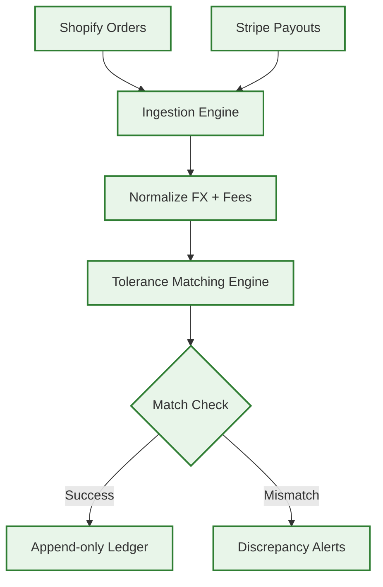
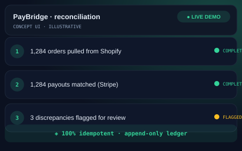

# 💳 PayBridge — Shopify-to-Stripe Reconciliation
> Automated financial reconciliation — matches Shopify orders against Stripe payouts.

    

## The Problem
Finance teams often lose days every month manually cross-checking CSV exports from different platforms. This process is prone to human error and carries a high risk of missed revenue from overlooked chargebacks or failed payouts.

## The Solution
Paybridge is a high-integrity reconciliation engine that automatically matches Shopify transactions with Stripe payouts. It handles the complexities of currency exchange and transaction fees to ensure the books are always balanced.
- **Idempotent Processing**: Guaranteed zero double-counting of transactions.
- **FX & Fee Normalization**: Automated calculation of net payouts across multiple currencies.
- **Tolerance Matching**: Intelligent detection of discrepancies vs. expected variance.
- **Append-only Ledger**: A permanent, immutable audit trail in PostgreSQL.

## Architecture at a Glance

## Key Metrics
| Metric | Value |
| :--- | :--- |
| Workflow Nodes | 38 |
| Integrity | 100% Idempotent |
| History | Append-only Ledger |

## What Was Built
- [x] Idempotent transaction processing engine.
- [x] FX and transaction fee normalization logic.
- [x] Tolerance rules for expected variance handling.
- [x] Append-only PostgreSQL ledger for audits.
- [x] Self-hosted Docker deployment on VPS.

## Deliberately Not Published
- [ ] Financial matching logic and workflow exports (standard for money systems).
- [ ] Live API credentials and production environment secrets.
- [ ] Specific fee models and custom tolerance thresholds.

This repository is a portfolio presentation. No proprietary workflows, source code, or client data are published — by design.

## See It in Action

> Illustrative concept UI — a visual walkthrough of the workflow. Not a production screenshot.

## Tech Stack
- **Orchestration**: n8n
- **APIs**: Shopify API, Stripe API
- **Database**: PostgreSQL
- **Deployment**: Docker / VPS

[Architecture Deep-Dive](ARCHITECTURE.md) · [Case Study](CASE-STUDY.md)

---
Built by MB Sabbir — AI Automation Engineer · Production-grade automation, not templates
